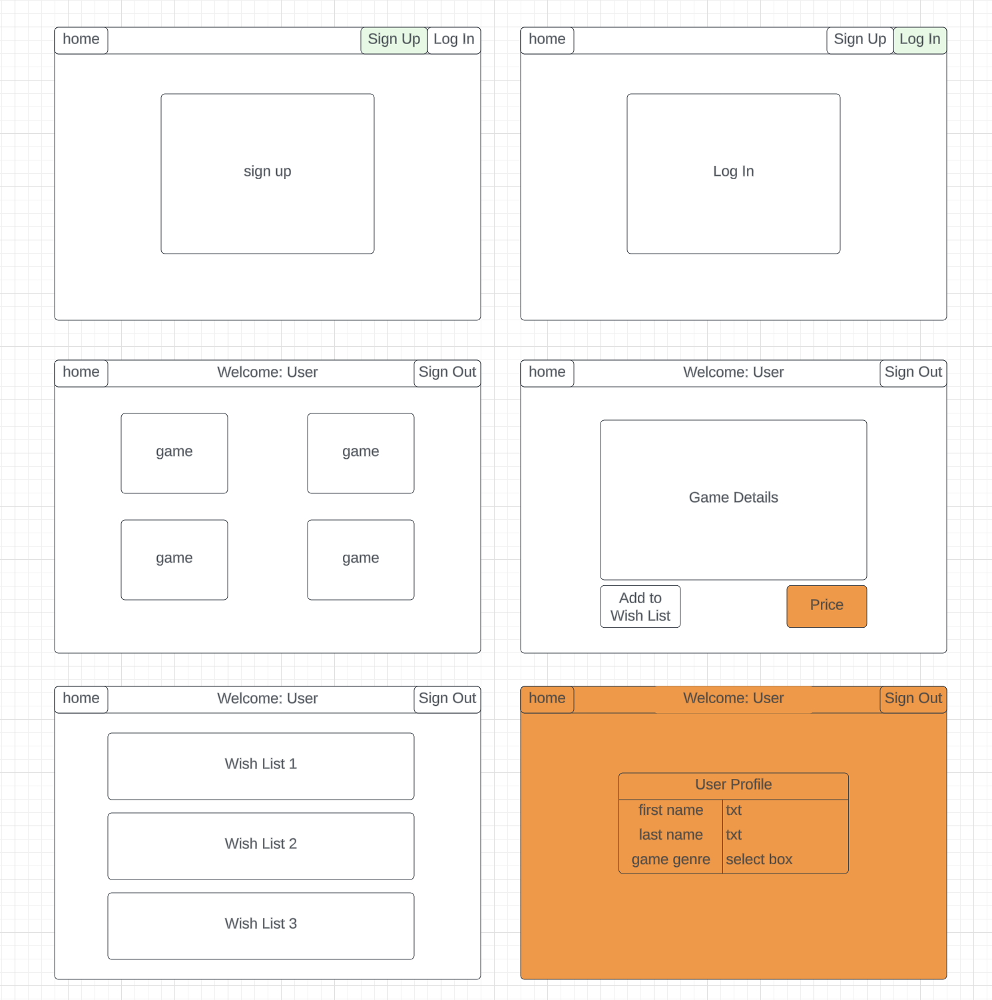
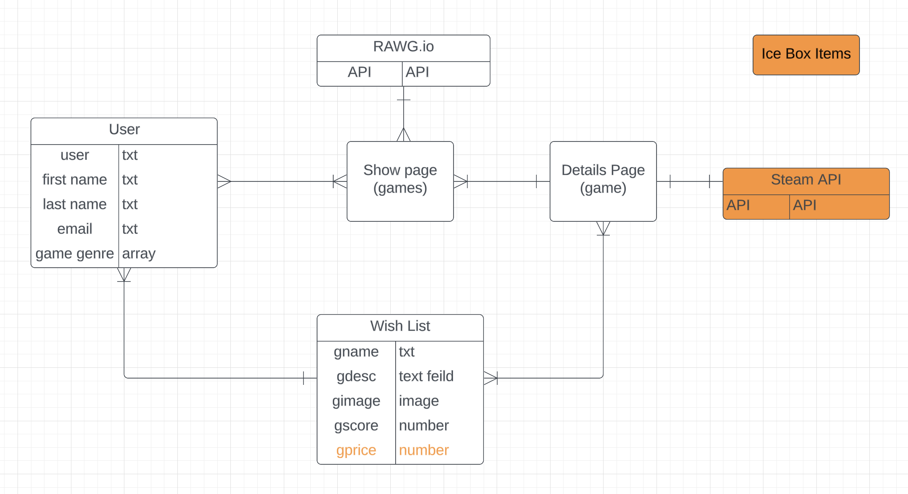

# Game Hub

GameHub is a online application that will display games, allow you to view thier details and add them to a wish list. Here you will find over 500 games to view! Search them by category or by name!

# App URL:

# User Stories
  - As a user, I want the ability to sign up.
  - As a user, I want the ability to sign in. 
  - As a user, I want the ability to sign out. 
  - As a user, I want the ability to view all games in a list.
  - As a user, I want the ability to read more details of individual games. 
  - As a user, I want the ability to view all my Wish Listed Games. 
  - As a user, I want the ability to delete my Wish Listed Items. 
  - As a user, I want the ability to add notes to my Wish Listed Items.
  - As a user, I want the ability to update notes to my Wish Listed Items.
  - As a user, I want the ability to delete notes to my Wish Listed Items.

# Wire Frame

# ERD

# Data Flow

# Technologies Used

- JavaScript
- Node.js
- Express
- REACT
- CSS3
- https://rawg.io
- react-bootstrap
- MongoDb
- Mongoose

# Fonts

- TDB

# V1 Images

# ICE BOX

- Add Price via Steam Look-Up
- Add API call to take use to game home page on steam